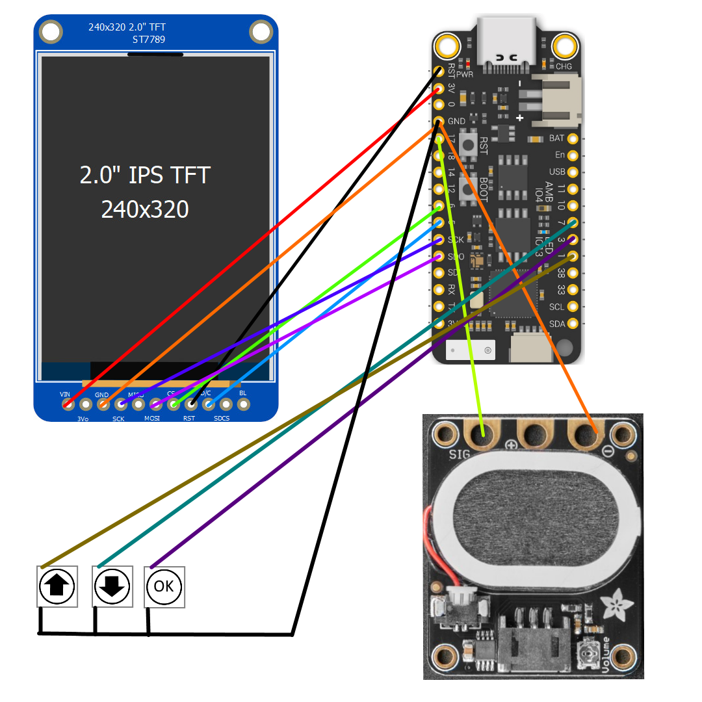

# DarkishTower
An homage to the classic Dark Tower board game written for the Feather S2 microcontroller and an LCD screen
Plays the entire original game, but you'll need to print a game board to go with it.

Video series showing the game and build process:
https://youtu.be/FMZSXwdLvgo

3D Models for the tower:
https://www.printables.com/model/160930-mini-dark-tower

Hardware used:
* FeatherS2: https://www.adafruit.com/product/4769
* LCD Screen: https://www.adafruit.com/product/4311
* Amp & Speaker: https://www.adafruit.com/product/3885

Tested using the Arduino IDE v1.8.19
See https://feathers2.io/ for setup details

Board: 
'UM Feather S2' found in the esp32 board library

Libraries needed:
Adafruit_ST7789
Adafruit_GFX

